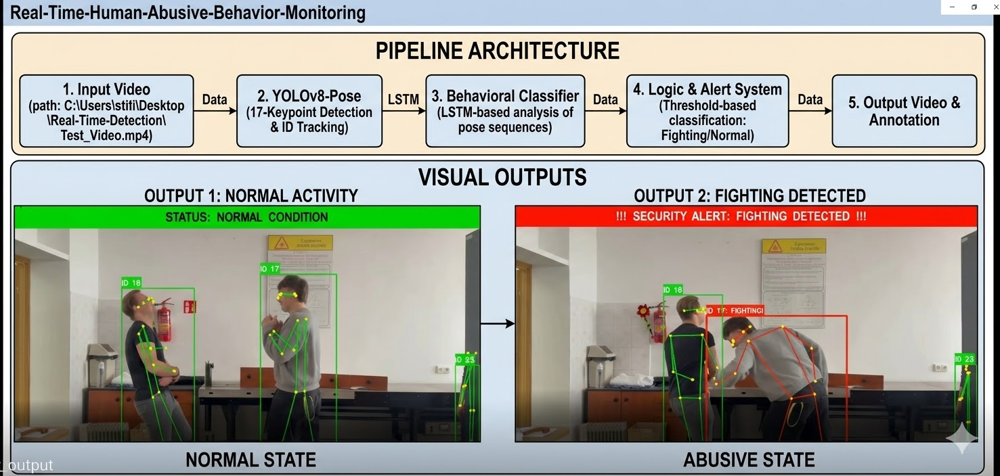

# Real-Time Human Abusive Behavior Monitoring 
# Real-Time Human Abusive Behavior Monitoring

This system uses **YOLOv8-Pose** and skeletal tracking to monitor human activities and automatically raise security alerts when abusive physical behavior (such as fighting) is detected in real-time.

## 📊 System Overview & Pipeline

This diagram shows the complete pipeline architecture, from raw video input through pose estimation and behavioral classification, to the final annotated visual outputs for Normal and Abusive states.



## 🚀 Key Features

* **Real-Time Pose Estimation:** Tracks 17 keypoints for every person in the frame.
* **Behavioral Classification:** Uses sequential analysis of pose data to differentiate between normal actions and abusive physical contact.
* **Automated Alerting:** Instantly triggers a red security banner when anomalies are detected.

## 🛠️ Built With

* [Python](https://www.python.org/)
* [OpenCV](https://opencv.org/)
* [PyTorch](https://pytorch.org/)
* [YOLOv8-Pose](https://github.com/ultralytics/ultralytics)

## 💻 How to Run

1.  **Clone the Repository:**
    ```bash
    git clone [https://github.com/shownirudra5/Real-Time-Human-Abusive-Behavior-Monitoring.git](https://github.com/shownirudra5/Real-Time-Human-Abusive-Behavior-Monitoring.git)
    cd Real-Time-Human-Abusive-Behavior-Monitoring
    ```
2.  **Install Dependencies:**
    (You will need PyTorch and Ultralytics installed. For a requirements.txt file, see below.)
3.  **Run the Main Script:**
    ```bash
    python real_time_detection.py
    ```